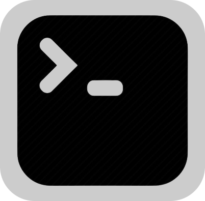

[<h1 style="font-size:60px; width:100%;">R-CLI</h1>](./appicon.png)

# 🏴 CLI (Command Line Interface) Using Cpp 🏴

## I am in the initial stage of the project

## Final Goal:
* is to make the full fledged Command Line Application which would have various feature like other CLI & other awesome new features as well